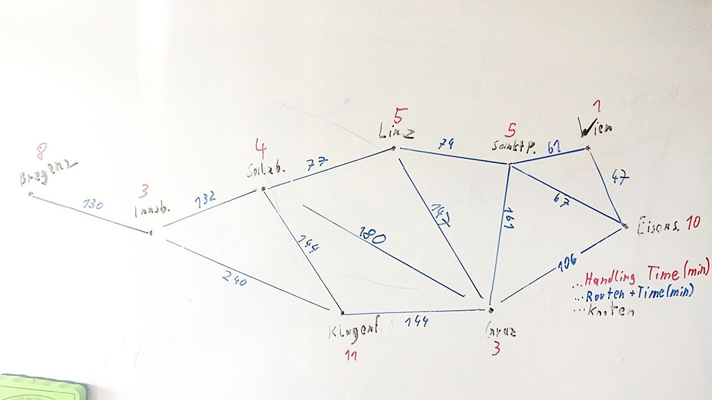

# Graphentheorie und Algorithmen

Bei einem Paketlogisker sollen die Versandabläufe opmiert werden. Bisher wurden alle Pakete zuerst an ein zentrales Verteilzentrum geliefert und von dort dann in die einzelnen Versandlager verteilt. Nun soll ein Programm geschaffen werden, dass für jedes Paket den opmalen Weg auswählt um einen möglichst schnellen Versandablauf zu ermöglichen. Das zentrale Lager wird deswegen aufgelöst und die Pakete werden direkt von Versandlager zu Versandlager befördert. Es kann jedoch aufgrund der hohen Anzahl der Versandlager nicht von jedem Versandlager zu jedem anderen Versandlager direkt transporert werden, sondern muss in den meisten Fällen über andere Versandlager als Zwischenlager transporert werden. Die Versandzeit eines Paketes wird sowohl von der Strecke zwischen zwei Lagern (Fahrtzeit) also auch von der Zeit für das Handling in den einzelnen Lagern (unterschiedlich abhängig von Mitarbeiteranzahl, technischer Ausstaung,…).

## A
Konstruieren Sie einen Graph der die Situaon abzubilden vermag. Für die Daten verwenden Sie die Bundeshauptstädte Österreichs und geschätzte Zeiten für Fahrzeit und Handling.

##B
Welche Algorithmen könnten für die Lösung dieser Aufgabenstellung verwendet werden
und wodurch unterscheiden sie sich.

* Dijkstra
  * Weit verbreitet
  * Berechnet den kürzesten Pfad
  * Die Grundidee des Algorithmus ist es, immer derjenigen Kante zu folgen, die den kürzesten Streckenabschnitt vom Startknoten aus verspricht. Andere Kanten werden erst dann verfolgt, wenn alle kürzeren Streckenabschnitte beachtet wurden. 
* A*
  * Weit verbreitet
  * Berechnet den kürzesten Pfad
  * Der A*-Algorithmus untersucht immer die Knoten zuerst, die wahrscheinlich schnell zum Ziel führen.
  * Benötigt Heuristiken, wie z.B. Luftlinie zwischen jedem Knoten + Ende

## C
Start: Graz
Ende: Innsbruck

1. Alle Konten als **unbesucht** markieren
2. **Vorläufigen Distanz** zu allen Konten auf **unendlich** setzen
3. **Vorläufigen Distanz** vom Startknoten auf **0** setzen
4. Jetzigen Knoten auf Startknoten setzen
5. Alle **unbesuchten** Nachbarn des jetzigen Knotens untersuchen
   1.  Distanz zwischen jetigen Knoten und Nachbarn berechnen
   2.  Wenn **Distanz** < **Vorläufigen Distanz** des Nachbarknotens dann **Vorläufigen Distanz** auf Distanz setzenntersuchen
   3.  Distanz = **Vorläufigen Distanz** jetziger Knoten + Distanz zwischen jetziger Knoten und Nachbarn + Handling Time
   4.  Wenn **Distanz** < **Vorläufigen Distanz** des Nachbarknotens dann **Vorläufigen Distanz** auf **Distanz** setzen
6.  Jetizgen Knoten als **besucht** markieren
7.  Jetzigen Knoten auf Knoten mit min(**Vorläufigen Distanz**) setzen
8.  Wenn (Jetziger Knoten == EndKnoten) {break} Else: GoTo 5

Jetzt anhand des Beispiels:
1. Alle Knoten werden in folgender Riehenfolge besucht:
   1. Graz
   2. Eisenstadt
   3. Linz
   4. Klagenfurt
   5. Wien
   6. Sankt Pölten
   7. Salzburg
   8. Innsbruck
2. Optimal Path:
   1. Graz (HT: 3) nach Salzburg (T: 180)
   2. Salzburg (HT: 4) nach Innsbruck (T: 132)
   3. Innsbruck (HT: 3) zum Kunden
   4. Absolute Distanz: 322