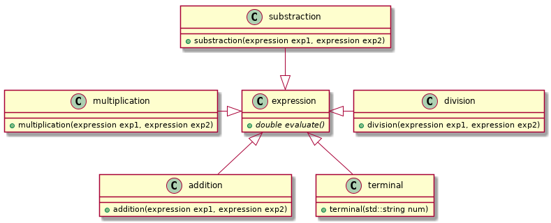

# Formale Sprachen - Parser

Für ein Finanz-Programm soll ein Mathematik-Modul entwickelt werden um direkt im Programm einfache Formeln berechnen zu können. Neben Zahlen sollen noch die Operationen + × ÷ - ^ und Klammern () unterstützt werden.

## A

> Entwickeln sie eine Grammatik für die Formeln und beschreiben sie sie in einer passenden BNF-Schreibweise.

**Grammatik:**

```
G = (N, T, P, S)

N = { <digit>, <sign>, <unsignedWholeNumber>, <unsignedNumber>, <number>, <operation>, <expression> }
T = { +, -, *, /, ^, (, ), ., 0, 1, 2, 3, 4, 5, 6, 7, 8, 9}
P = {
    <expression> -> <expression><operation><expression> | <number> | (<expression>),
    <operation> -> + | - | * | / | ^
    <number> -> <unsignedNumber> | <sign><unsignedNumber>,
    <sign> -> - | +
    <unsignedNumber> -> <unsignedWholeNumber> | <unsignedWholeNumber>.<unsignedWholeNumber>,
    <unsignedWholeNumber> -> <digit> | <digit><unsignedWholeNumber>
    <digit> -> 0 | 1 | 2 | 3 | 4 | 5 | 6 | 7 | 8 | 9
}

S = <expression>

```

**Beschreibung mittels ISO-EBNF:**
```
digit = "0"|"1"|"2"|"3"|"4"|"5"|"6"|"7"|"8"|"9"
sign = "+" | "-"
integer = digit { digit } [ "." digit { digit } ]
number = [sign] integer
operation = "+" | "-" | "*" | "/" | "^"
expression = expression operation expression | number | (expression)
```

## B

> Erklären Sie, wie diese Grammatik klassifiziert werden kann und wie sich die Klassifizierungsstufen unterscheiden. 

| Typ | Sprache | erzeugt durch |
| :--------: | :--------: | :--------: |
| Typ-0    | unbeschränkte Sprachen     | beliebige Grammatik     |
| Typ-1 | kontextsensitive Sprachen | kontextsensitive Grammatik |
| Typ-2 | kontextfreie Sprachen | kontextfreie Grammatik |
| Typ-3 | reguläre Sprachen | reguläre Grammatik | 

## C

> Beschreiben sie eine LL (1) Grammatik und worauf bei den Formeln geachtet werden muss damit sie als LL (1) Grammatik funktionieren.

Ein LL(1) Parser für eine LL(1) Grammatik:

* liest und untersucht das Eingabewort von links nach rechts.
* liefert immer eine linkskanonische Ableitung, wenn eine Ableitung möglich ist.
* liest genau 1 Zeichen voraus.

Eine LL(k)-Grammatik ist eine spezielle kontextfreie Grammatik, welche die Grundlage eines LL(k)-Parsers bildet.

Eine kontextfreie Grammatik heißt LL(k)-Grammatik für eine natürliche Zahl k, wenn jeder Ableitungsschritt eindeutig durch die nächsten k Symbole der Eingabe (Lookahead) bestimmt ist. Das bedeutet, die Frage, welches Nichtterminalsymbol mit welcher Regel als Nächstes expandiert werden soll, kann eindeutig mit Hilfe der nächsten k Symbole der Eingabe bestimmt werden.

## D

> Planen Sie ein UML-Klassendiagramm für einen Formel-Parser und zeigen Sie, welches Software-Design-Pattern für einen solchen Parser verwendet werden kann.


